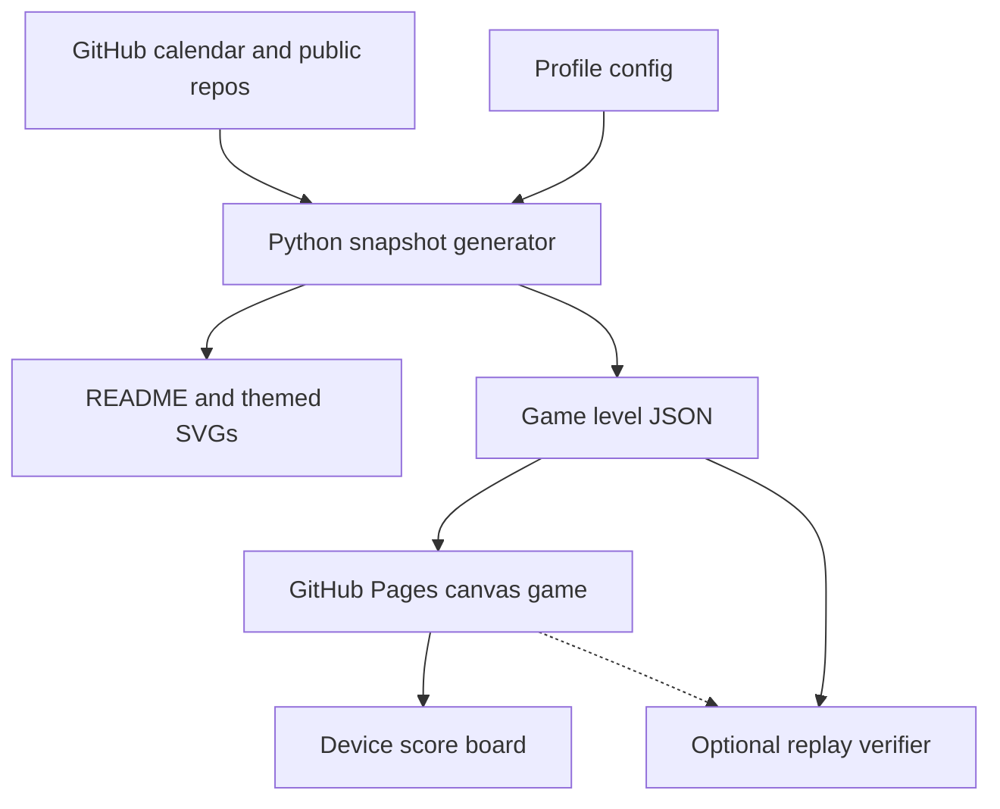

<!-- PROFILE:START -->

# Manoj Kumar Bondada

<a href="https://manojkumar0013.github.io/ManojKumar0013/game/">
<picture>
  <source media="(max-width: 600px) and (prefers-color-scheme: dark)" srcset="assets/dark/boot-mobile.svg">
  <source media="(max-width: 600px)" srcset="assets/light/boot-mobile.svg">
  <source media="(prefers-color-scheme: dark)" srcset="assets/dark/boot.svg">
  
</picture>
</a>

**[▶ PLAY THE GAME](https://manojkumar0013.github.io/ManojKumar0013/game/)**

I’m a B.Tech Computer Science student working toward AI/ML engineering roles. I build full-stack systems and am learning to design reproducible ML experiments, compare baselines, and explain what the metrics mean.

[Linkedin](https://www.linkedin.com/in/manoj-kumar-bondada-a92410384) · [Email](mailto:manojkumarbondada123@gmail.com) · [Portfolio](https://frontend-steel-nine-30.vercel.app/)

<picture>
  <source media="(max-width: 600px) and (prefers-color-scheme: dark)" srcset="assets/dark/training-mobile.svg">
  <source media="(max-width: 600px)" srcset="assets/light/training-mobile.svg">
  <source media="(prefers-color-scheme: dark)" srcset="assets/dark/training.svg">
  
</picture>

<picture>
  <source media="(max-width: 600px) and (prefers-color-scheme: dark)" srcset="assets/dark/skills-mobile.svg">
  <source media="(max-width: 600px)" srcset="assets/light/skills-mobile.svg">
  <source media="(prefers-color-scheme: dark)" srcset="assets/dark/skills.svg">
  
</picture>

<picture>
  <source media="(max-width: 600px) and (prefers-color-scheme: dark)" srcset="assets/dark/achievements-mobile.svg">
  <source media="(max-width: 600px)" srcset="assets/light/achievements-mobile.svg">
  <source media="(prefers-color-scheme: dark)" srcset="assets/dark/achievements.svg">
  
</picture>

[Latest public commit](https://github.com/ManojKumar0013/portfolio/commit/2bd21cce223646ff038de24c015d7720c0115bcc) · [Earliest public PR found](https://github.com/kitlord/First-issue/pull/61)

<picture>
  <source media="(max-width: 600px) and (prefers-color-scheme: dark)" srcset="assets/dark/stages-mobile.svg">
  <source media="(max-width: 600px)" srcset="assets/light/stages-mobile.svg">
  <source media="(prefers-color-scheme: dark)" srcset="assets/dark/stages.svg">
  
</picture>

| Project | What it does |
| --- | --- |
| [Portfolio](https://github.com/ManojKumar0013/portfolio) | Interactive project showcase with a 3D robotic arm. |
| [HungryHub](https://github.com/ManojKumar0013/HungryHub-Online-Food-Ordering-System-) | Multi-role food ordering with a PostgreSQL data model. |
| [ICEPOPS](https://github.com/ManojKumar0013/icepop) | Online ordering, loyalty and live order tracking. |
| [NexTune](https://github.com/ManojKumar0013/EMOTION_BASED_MUSIC_WEBSITE) | Mood-based music discovery with the Jamendo API. |
| [Clinic Scheduler](https://github.com/ManojKumar0013/23CSE111_CLINIC_APPOINTEMENT_SYSTEM_C4) | Java team project for appointments and schedules. |
| [Time Tick Quiz](https://github.com/ManojKumar0013/Time-Tick-Quiz) | Python quiz project. |

<a href="https://manojkumar0013.github.io/ManojKumar0013/game/">
<picture>
  <source media="(max-width: 600px) and (prefers-color-scheme: dark)" srcset="assets/dark/level-mobile.svg">
  <source media="(max-width: 600px)" srcset="assets/light/level-mobile.svg">
  <source media="(prefers-color-scheme: dark)" srcset="assets/dark/level.svg">
  
</picture>
</a>

<picture>
  <source media="(max-width: 600px) and (prefers-color-scheme: dark)" srcset="assets/dark/scores-mobile.svg">
  <source media="(max-width: 600px)" srcset="assets/light/scores-mobile.svg">
  <source media="(prefers-color-scheme: dark)" srcset="assets/dark/scores.svg">
  
</picture>

<picture>
  <source media="(max-width: 600px) and (prefers-color-scheme: dark)" srcset="assets/dark/contact-mobile.svg">
  <source media="(max-width: 600px)" srcset="assets/light/contact-mobile.svg">
  <source media="(prefers-color-scheme: dark)" srcset="assets/dark/contact.svg">
  
</picture>

[Linkedin](https://www.linkedin.com/in/manoj-kumar-bondada-a92410384) · [Email](mailto:manojkumarbondada123@gmail.com) · [Portfolio](https://frontend-steel-nine-30.vercel.app/)

<!-- PROFILE:END -->

<code>$ cat HOW_IT_WORKS.txt</code>

GitHub cannot run the game inside the README. The panels are self-contained SVGs selected by theme and viewport. The two playable panels link to GitHub Pages.

```mermaid
flowchart TD
    GH["GitHub calendar and public repos"] --> GEN["Python snapshot generator"]
    CFG["Profile config"] --> GEN
    GEN --> SVG["README and themed SVGs"]
    GEN --> DATA["Game level JSON"]
    DATA --> GAME["GitHub Pages canvas game"]
    GAME --> LOCAL["Device score board"]
    GAME -.-> WORKER["Optional replay verifier"]
    DATA --> WORKER
```

- With a token, GitHub GraphQL provides the calendar. A best-effort public parser validates daily counts when GraphQL is unavailable. REST provides public repositories, language evidence, recent authored commits, and the earliest public pull request found.
- Arcade skill levels are capped counts of public non-fork repositories with matching languages, topics, or configured dependency manifests. An empty evidence count keeps a skill in training. The loss curve is an illustration.
- Each active calendar day creates one game coin. A fixed 60 Hz simulation makes the same level and input log replayable in the browser and on the server.
- Actions checks the full generated snapshot before publishing. A failed refresh leaves the previous snapshot available.

[Make your own or deploy the game](CONTRIBUTING.md) · [View the release plan](plan/plan.md)

## What I learned building this

- I learned to separate the data model from the presentation. The same contribution calendar drives the README map and the playable level.
- I learned to make browser gameplay reproducible by recording input changes per tick. The server can recompute the score independently from the browser.
- I learned to treat missing evidence as a data state. The profile distinguishes a learning goal from a public repo signal and tests how the pipeline handles missing or malformed inputs.
